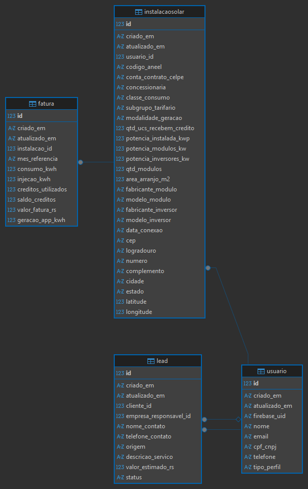

# Radar Solar - MVP

Este projeto foi desenvolvido como artefato avaliativo para a disciplina de **Projetos 1** (2026.1), do curso de **Banco de Dados com ênfase em Ciência de Dados e IA** da **CESAR School**.

O **Radar Solar** é uma plataforma digital concebida para aproximar clientes com centrais de geração de energia solar (B2C) e empresas integradoras/prestadoras de serviços de manutenção (B2B). 

---

## Arquitetura do Projeto e Mapeamento de Requisitos

```text
radar-solar/
├── .gitignore              # RNF01 - Setup e Ambiente (Filtro de ficheiros locais)
├── README.md               # RNF01 - Manual e documentação do repositório
├── requirements.txt        # RNF01 - Dependências do ecossistema Python
├── run.py                  # RNF01 - Chave de ignição do projeto na raiz (DX)
│
├── data/                   # Dados locais analíticos (.parquet) e SQLite (Ignorados pelo Git)
│   └── .gitkeep            # Garante que a diretoria existe no repositório
│
├── docs/                   # RNF06 - Preparação para o SR2 (Diagramas, Modelo ER, etc.)
│   └── .gitkeep            # Garante que a diretoria existe no repositório
│
└── src/                    # APENAS CÓDIGO FONTE EXECUTÁVEL
    ├── main.py             # RNF01 (Ponto de partida) e RNF03 (Ficheiro lido pelo servidor Cloud)
    ├── database.py         # RNF02 - Conexão bruta com a base de dados SQLite
    ├── models.py           # RNF02 - Classes de domínio Peewee (Usuario, Fatura, Endereco, Lead)
    └── ui/                 # Camada de Interface com o Utilizador (User Interface)
        ├── assets/         
        │   └── images/     # Ativos visuais públicos (Ex: logo_radar_solar.png)
        ├── components/     # RF03 - Cartões modulares reutilizáveis (Consumo, Injeção, Layout SPA)
        └── pages/          # Páginas isoladas por contexto de negócio e rotas
            ├── public/     
            │   ├── homepage.py    # Landing page institucional do Radar Solar
            │   └── login.py       # RF01 (Firebase Magic Link) e RF01.1 (Seleção de Perfil)
            ├── cliente/    
            │   ├── dashboard.py   # RF03 (Visão B2C e Alertas) e RF05 (Botão de Gatilho/Lead)
            │   └── faturas.py     # RF04 - Inserção de Fatura (CRUD B2C)
            └── empresa/    
                ├── kanban.py      # RF06 - Funil de Vendas B2B (Gestão de Leads)
                └── mapa.py        # RF02 - Mapa de Calor (Integração de Dados ANEEL)

```

### Diagrama Entidade-Relacionamento (DER)
